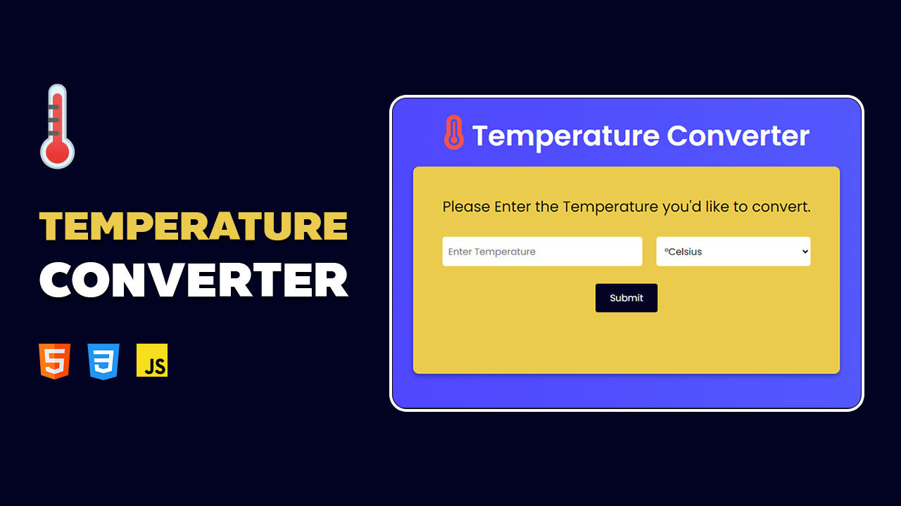

# Build a simple Temperature Converter with HTML CSS and JavaScript
# Subscribe on the YouTube Channel [link](https://www.youtube.com/@DevLabTutorials?sub_confirmation=1)

## Watch the Full Tutorial on YouTube [link](https://youtu.be/ZNbdYB1IbDg)

